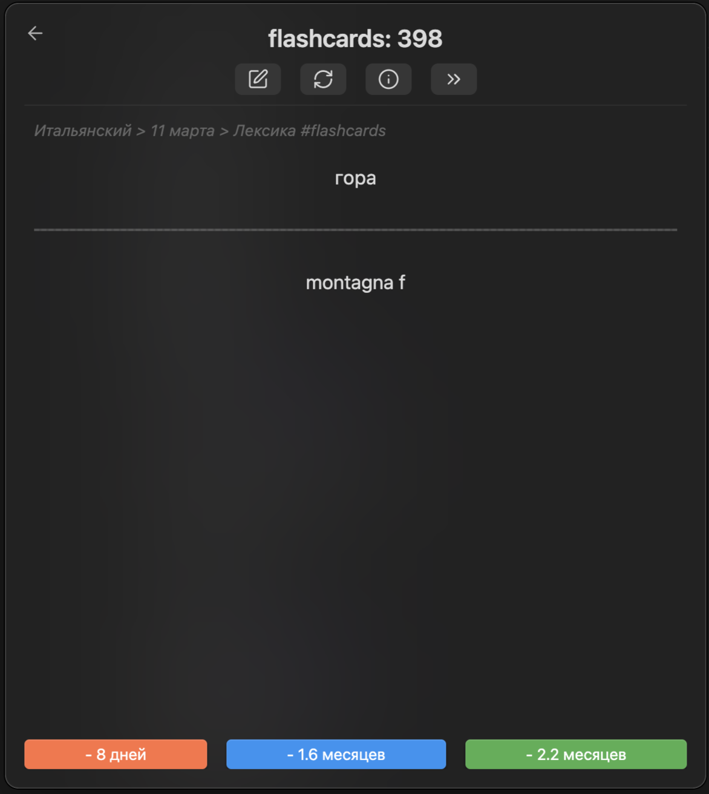

## Итальянский

### Учу итальянский уже месяц, использую:
**Анки-стайл карточки** в виде плагине для [Obsidian](https://obsidian.md)

**Rosetta Stone**

**Учебник Буэно Т., Шевлякова Д.А. - Полный курс итальянского языка для начинающих**

### Выучил/освоил

#### Склонение существительных в итальянском языке

##### Окончания по роду и числу

| Род            | Единственное число | Множественное число | Пример                |
|----------------|--------------------|---------------------|------------------------|
| Мужской (m)    | -o                 | -i                  | ragazzo → ragazzi     |
| Женский (f)    | -a                 | -e                  | ragazza → ragazze     |
| Муж./Жен. (m/f)| -e                 | -i                  | studente → studenti   |
| Исключения     | —                  | —                   | problema (m) → problemi mano (f) → mani |

---

###### Примеры:

- ragazzo → ragazzi  
- ragazza → ragazze  
- studente → studenti  
- attrice → attrici  
- dottore → dottori  
- lezione → lezioni  
- problema → problemi  
- mano → mani  

---

> 💡 Некоторые слова имеют **неожиданный род** или окончание, особенно те, что заканчиваются на -ma (проблема, тема, диплома) — они мужского рода, несмотря на -a.

#### Спряжение правильных глаголов в настоящем времени

##### 1-я группа: глаголы на -ARE (es. parlare — говорить)

| Лицо          | Форма         |
|---------------|---------------|
| io            | parlo         |
| tu            | parli         |
| lui / lei     | parla         |
| noi           | parliamo      |
| voi           | parlate       |
| loro          | parlano       |

---

##### 2-я группа: глаголы на -ERE (es. prendere — брать)

| Лицо          | Форма         |
|---------------|---------------|
| io            | prendo        |
| tu            | prendi        |
| lui / lei     | prende        |
| noi           | prendiamo     |
| voi           | prendete      |
| loro          | prendono      |

---

##### 3-я группа: глаголы на -IRE (es. dormire — спать)

| Лицо          | Форма         |
|---------------|---------------|
| io            | dormo         |
| tu            | dormi         |
| lui / lei     | dorme         |
| noi           | dormiamo      |
| voi           | dormite       |
| loro          | dormono       |

---

##### 3-я группа (с вставкой -isc-, es. finire — заканчивать)

| Лицо          | Форма         |
|---------------|---------------|
| io            | finisco       |
| tu            | finisci       |
| lui / lei     | finisce       |
| noi           | finiamo       |
| voi           | finite        |
| loro          | finiscono     |

---

> 💡 Некоторые глаголы 3-й группы добавляют вставку **-isc-** перед окончанием в **1, 2, 3 лице ед. числа** и **3 лице мн. числа**.
> Таких глаголов много: capire (понимать), preferire (предпочитать), pulire (чистить).

#### Passato Prossimo: Спряжение глаголов **avere** и **essere**

##### A. С глаголом **avere** (иметь)

| Лицо        | Спряжение (parlare) |
|-------------|---------------------|
| io          | ho parlato          |
| tu          | hai parlato         |
| lui / lei   | ha parlato          |
| noi         | abbiamo parlato     |
| voi         | avete parlato       |
| loro        | hanno parlato       |

> Используется с большинством глаголов действия, особенно с переходными (т.е. с прямым дополнением):
> **Ho mangiato la pizza.** — Я съел пиццу.

---

##### B. С глаголом **essere** (быть)

| Лицо        | Спряжение (andare)       |
|-------------|--------------------------|
| io          | sono andato/a            |
| tu          | sei andato/a             |
| lui / lei   | è andato/a               |
| noi         | siamo andati/e           |
| voi         | siete andati/e           |
| loro        | sono andati/e            |

> Используется с глаголами движения, изменения состояния, рождения, смерти и возвратными глаголами.
> Причастие **согласуется по роду и числу**:
> - **Sono andato** (я ушёл — мужчина)
> - **Sono andata** (я ушла — женщина)
> - **Siamo andati** (мы ушли — мужчины/смешанная группа)
> - **Siamo andate** (мы ушли — женщины)

---

##### Список частых глаголов с **essere**

- andare — идти
- venire — приходить
- arrivare — прибывать
- partire — уезжать
- entrare — входить
- uscire — выходить
- nascere — рождаться
- morire — умирать
- diventare — становиться
- restare — оставаться
- tornare — возвращаться
- cadere — падать
- stare — находиться
- essere — быть

---

#### Дни недели

- **lunedì** (m) — понедельник  
- **martedì** (m) — вторник  
- **mercoledì** (m) — среда  
- **giovedì** (m) — четверг  
- **venerdì** (m) — пятница  
- **sabato** (m) — суббота  
- **domenica** (f) — воскресенье  

---

#### Месяцы года

- **gennaio** (m) — январь  
- **febbraio** (m) — февраль  
- **marzo** (m) — март  
- **aprile** (m) — апрель  
- **maggio** (m) — май  
- **giugno** (m) — июнь  
- **luglio** (m) — июль  
- **agosto** (m) — август  
- **settembre** (m) — сентябрь  
- **ottobre** (m) — октябрь  
- **novembre** (m) — ноябрь  
- **dicembre** (m) — декабрь  

---

#### Числа 1–100

**1** uno  
**2** due  
**3** tre  
**4** quattro  
**5** cinque  
**6** sei  
**7** sette  
**8** otto  
**9** nove  
**10** dieci  

**20** venti  
**30** trenta  
**40** quaranta  
**50** cinquanta  
**60** sessanta  
**70** settanta  
**80** ottanta  
**90** novanta  
**100** cento

---

**TBC**