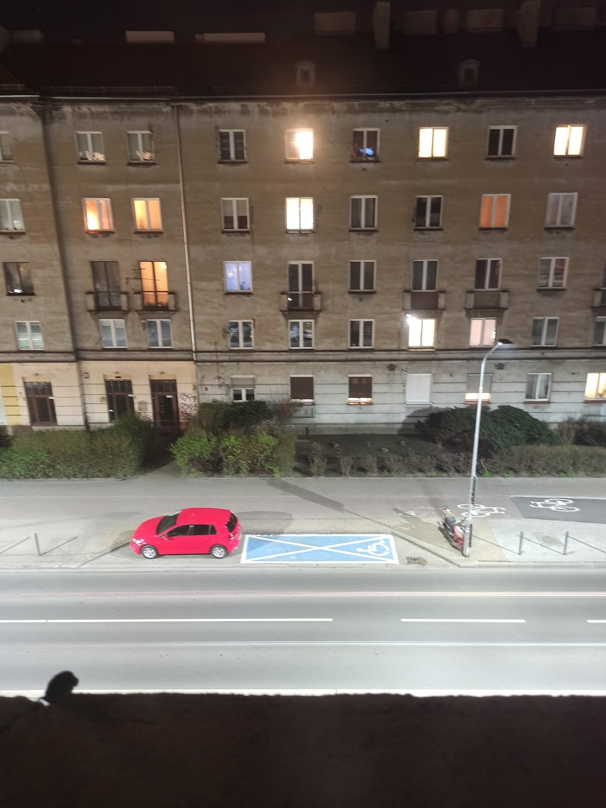
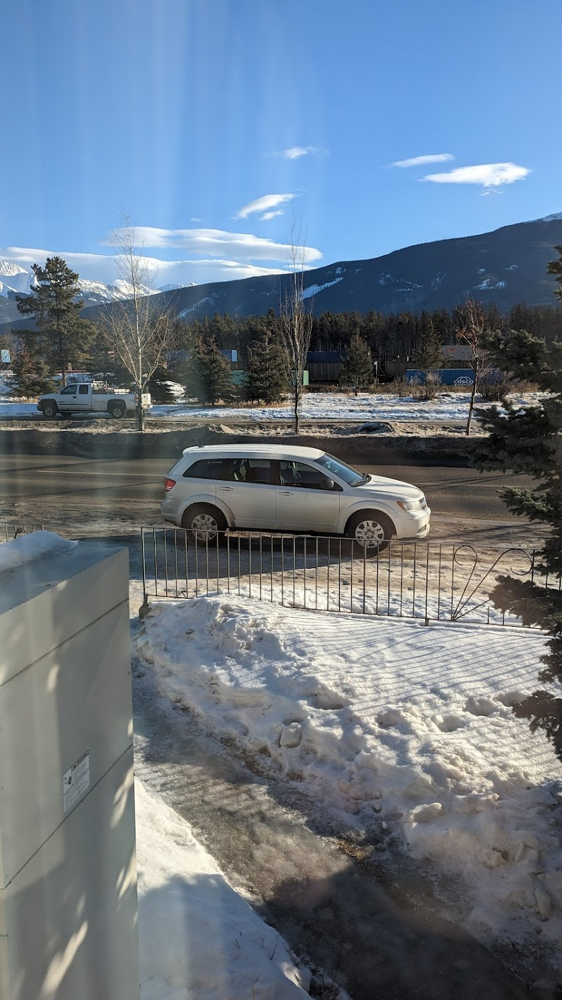
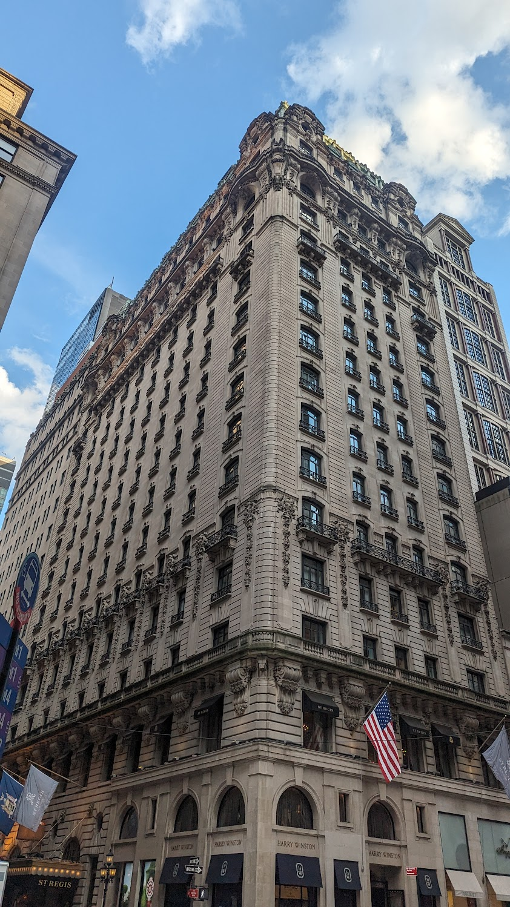
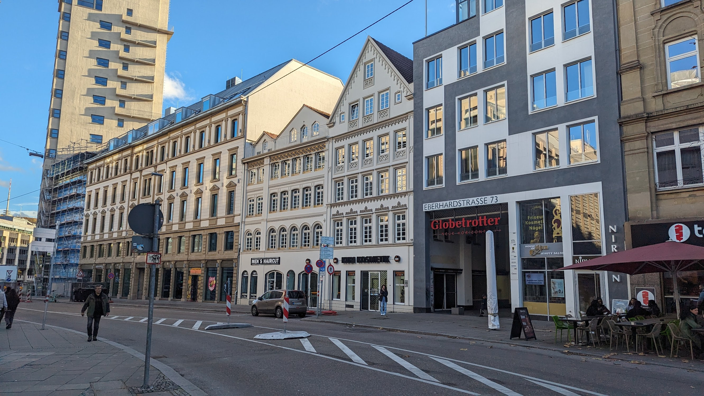
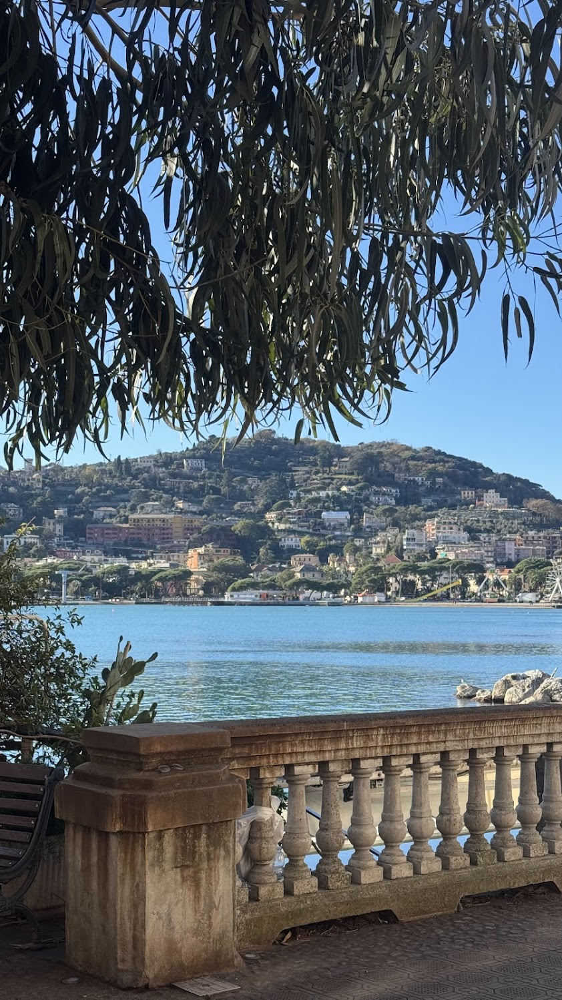

### Польша

Я выехал из Украины сразу после окончания школы - в 17 лет.  

Первой страной где я начал осознанную взрослую жизнь была Польша, в Польше я успел бросить два университета, сменить 4 работы и выучить около-идеально язык. 

После шести лет жизни во Вроцлаве, Польша себя исчерпала для меня как страна для жизни. Последние несколько лет там у меня в голове была такая мысль: "учитывая что я принял себя как вечного мигранта, и в Украину я уже никогда не вернусь, зачем останавливаться на Польше?".  

После начала войны в 2022 году я окончательно порвал с Польшей.

### Канада

Следующей страной была Канада. Я прожил в маленьком курортной городе Джаспер, Альберта около года работая там помощником электрика.  

По началу я был на волне эйфории и думал что это лучшая страна на Земле, но со временем энтузиазм начал угасать и я понял что я не вижу себя в этой стране на долгосрок.  

Главными причинами моего расставания с Канадой были цены на покупку жилья (600к+ за что-то минимально пригодной для жизни), отвратительная погода (9 месяцев в году жить не хочется), и максимально машиноцентричный способ жизни канадцев (отсутствие парков, тротуаров итд).

### США

Следующей страной в моем списке оказалась Америка, а конкретней город Нью-Йорк.
Прожив там пол года и проработав флагером (регулировщик трафика на минималках) я понял что Северная Америка точно не для меня. Люди и максимально дико-капиталистический устрой общества были для меня максимально противны и я покинул Штаты.

### Германия

Дальше была Германия, Штуттгарт.  

То, что должно было быть одним из самых богатых и благополучных городов Германии, оказалось наиунылейшим местом с полным отсутствием понимания чем тут можно заняться кроме работы и сидения дома. Работа моя была конем на заводе.  

После полутора года жизни в режиме коня не видящего ничего кроме стен завода и своей комнаты, я понял что пора закругляться и что-то менять.

### Италия

Теперь я здесь, а конкретнее - в Рапалло. За годы скитаний по миру я не нашел места приятнее моей душе. Здесь есть все о чем я мечтал: идеальный климат (+10 зимой, +25 летом), море, горы, архитектура и природа. Плюсом ко всему здесь относительно дешевая недвижимость по сравнению с другими приморскими городами южной Европы и дешевая сама по себе жизнь.  

Пока что я нашел свое место здесь, если что-то изменится - дам знать.